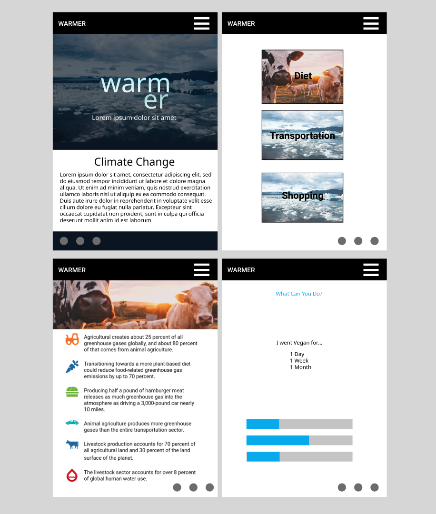

# Warmer 
Warmer is an app dedicated to fighting **Climate Change**. The main goal of Warmer is to allow you to see your every day impact on climate change whether it be big or small, and assist you in making practical changes to limit your footprint.

[Warmer](#)

## Run
 - Clone down from repo 
 - Navigate into the main folder via CLI
 - Run `npm install`
 - Run `npm run start`

> **ProTip:** You can disable any **Markdown extension** in the **File properties** dialog.

## Technologies Used
`React, TypeScript, Html, CSS`

## Contact
Heather Zurek
Heather.Zurek@gmail.com