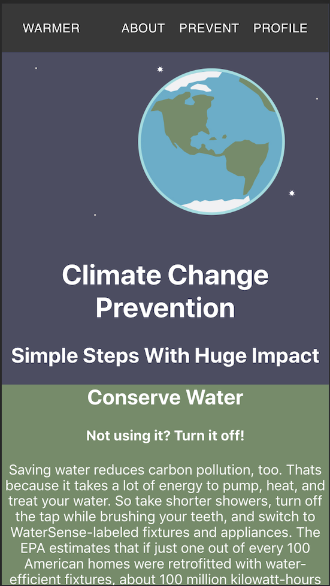

# Warmer 
Warmer is an app dedicated to fighting **Climate Change**. The main goal of Warmer is to allow you to see your every day impact on climate change whether it be big or small, and assist you in making practical changes to limit your footprint.

<!-- [Warmer](#) -->

- 8 - 9am: researched climate change data
- 9 - 10am: used figma to create a rough mock up of layout
- 10 - 11am: Built react app
- 11 - 12pm: Added Navbar and modified
- 1 - 2pm: Added some basic styling to test colors and splash page layout
- 2 - 3pm: Researched connecting firebase with react
- 3 - 4pm:  Firebase cont.
- 4 - 5pm: Readme cleanup with Stackedit.io

## Run
 - Clone down from repo 
 - Navigate into the main folder via CLI
 - Run `npm install`
 - Run `npm run start`

> **ProTip:** You can disable any **Markdown extension** in the **File properties** dialog.

## Technologies Used
`React, TypeScript, Html, CSS`

## Contact
Heather Zurek
Heather.Zurek@gmail.com